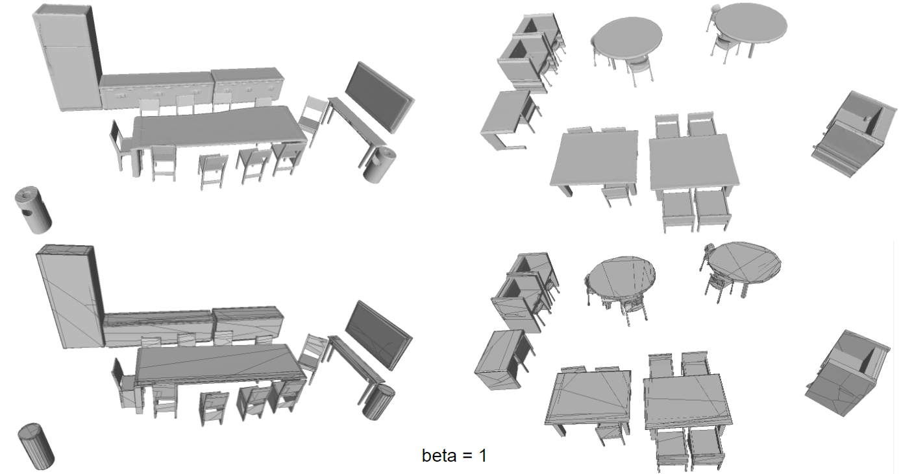
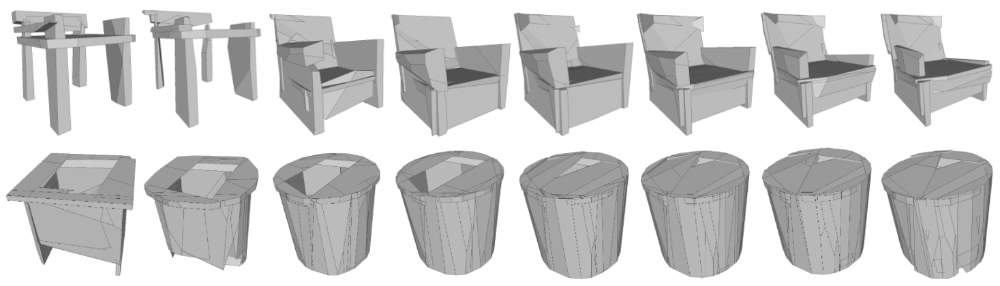

# BSP-CVAE 
This repo implements a BSP-CVAE model, which uses the idea of [BSP-Net](https://bsp-net.github.io/) but is a generative model.

* reconstruction on ScanNet:



* generation (interpolated latent codes):




### Install

This repo is tested on `Ubuntu16.04, CUDA 10.1`.    
For the python dependencies, see `requirements.txt`.  
We also use two `Cython` extensions, install them by `python setup.py build_ext --inplace`.  

```bash
conda env create -n bsp
conda activate bsp

pip install -r requirements.txt
python setup.py build_ext --inplace
```


### Datasets

Data are assumed to be located in `${data_root}/datasets/`, where `${data_root}` can be set in `main.py`.

* `ShapeNet`  
We use the preprocessed data provided by [RfDNet](https://github.com/yinyunie/RfDNet), please follow their [instructions](https://github.com/yinyunie/RfDNet#preprocess-shapenet-data) and put it under `${data_root}/datasets/ShapeNetv2_data`.
We use 8 classes (`'table', 'chair', 'bookshelf', 'sofa', 'trash_bin', 'cabinet', 'display', 'bathtub'`) in ShapeNet to train the model.

* `ScanNet & Scan2CAD`  
If you want to test the reconstruction performance under indoor scenes, you should also download preprocessed ScanNet and Scan2CAD datasets following these [instructions](https://github.com/yinyunie/RfDNet#preprocess-scannet-and-scan2cad-data), and put it under `${data_root}/datasets/scannet`.


### Train

The options and parameters should be modified directly in `main.py`.  

```bash
# train with default settings.
bash train.sh
```

It takes about 4 days to train the model for 800 epochs on a single GPU.

Logs are saved in `workspace/log_${exp_name}.txt`.  
Checkpoints are saved in `workspace/checkpoints`.  
Tensorboard records are saved in `workspace/run`.  


### Test 

After training, just run the tests as follows:  

```bash
# reconstruction on shapenet
CUDA_VISIBLE_DEVICES=1 OMP_NUM_THREADS=1 python main.py --checkpoint latest --test_shapenet
# generation
CUDA_VISIBLE_DEVICES=1 OMP_NUM_THREADS=1 python main.py --checkpoint latest --generate
# interpolated generation
CUDA_VISIBLE_DEVICES=1 OMP_NUM_THREADS=1 python main.py --checkpoint latest --interpolated_generate

# reconstruction on scannet
CUDA_VISIBLE_DEVICES=1 OMP_NUM_THREADS=1 python main.py --checkpoint latest --test_scannet

# save zs
CUDA_VISIBLE_DEVICES=1 OMP_NUM_THREADS=1 python main.py --checkpoint latest --save_z

# save database
CUDA_VISIBLE_DEVICES=1 OMP_NUM_THREADS=1 python main.py --checkpoint latest --save_db
```

Results are saved in `workspace/results`.  


### References
* BSP-Net: [paper](https://arxiv.org/pdf/1911.06971.pdf) | [code](https://github.com/czq142857/BSP-NET-pytorch) | [project](https://bsp-net.github.io/).
* RfDNet: [paper](https://arxiv.org/abs/2011.14744) | [code](https://github.com/yinyunie/RfDNet) | [project](https://yinyunie.github.io/RfDNet-Page/).